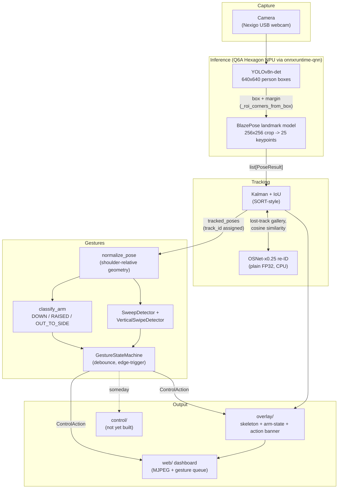

# The Pose-Controller journey

A narrative retrospective of how this project got from an empty repo to a
working, gesture-controlled, on-device pipeline running entirely on a
Radxa Dragon Q6A's Hexagon NPU -- what was built, in what order, what
broke, and what each break taught the next decision. For the
line-by-line technical trail (exact numbers, exact commands, exact
failed attempts), see `scripts/qnn_spike.md`; for what's still open, see
`docs/backlog.md`; for the current architecture without the history, see
`docs/architecture.md`. This document is the story that connects them.

## The shape of the pipeline today

Every box in that diagram exists because something specific broke or
proved insufficient. The rest of this document is the order it happened
in, but here's the shape of that order first:

```mermaid
timeline
    title Pose-Controller: from empty repo to gesture-triggered NPU pipeline
    Scaffolding + NPU spike : board bring-up (image, BIOS, EDL)
                             : qnn-net-run works, but ~476ms/frame
    Latency fix             : persistent onnxruntime-qnn session
                             : ~26ms/frame (~18x) -- unlocks everything after
    Multi-person tracking   : Kalman + IoU (SORT-style)
                             : "does it survive leaving frame?" -- it didn't
    Appearance re-ID        : OSNet-x0.25, plain FP32 CPU
                             : _try_revive() embedding-order bug found by a test
    Gesture recognition     : normalize / static poses / debounce / sweep
                             : validated synthetically + one static photo only
    Live-camera round 1     : dim, upward-angled Nexigo capture fails
                             : root cause unidentified at the time
    Live-camera round 2     : cheese-boosted capture -- real overexposure
                             : assess_exposure() built
    Live-camera round 3     : CSI camera bring-up, clean image, still fails
                             : crop test finds the real cause -- 128x128 detector
    YOLOv8n-det fix         : real detection on real footage, 0% to 90%
                             : orientation bug corrected along the way
    First real gestures     : all four original actions fire on real footage
                             : re-ID threshold retuned from measured data
    Volume gestures         : two design attempts fail before the real fix
                             : debounce-lag was the hidden cause both times
    Web dashboard           : live overlay + gesture queue, stdlib only
    Flicker + ghosting      : held-overlay fix, then overlap-dedup fix
                             : root cause still open -- camera framing? tracker?
    YOLO26-Pose evaluation  : alongside pipeline, not a replacement
                             : built to help answer the question above
    YOLO26 AI Hub failure   : both variants fail QNN compile via AI Hub
                             : QCS6490 also confirmed to lack FP16 support
    HRNetPose evaluation    : second alongside pipeline, w8a8 like the rest
                             : compiles clean where AI Hub's YOLO26 didn't
    Q8B investigated        : different chip than assumed, initially misread as blocked
                             : real hardware test proved it's a viable second target
    YOLO26 unblocked        : Ultralytics' own local QNN export succeeds
                             : Q8B confirmed, Q6A load failure -> soc_model fix -> both work
    YOLO26 real-footage test : 49%->96% detection, fragmentation gone
                             : same cheese recording, single-person only
```

## Milestone 0-1: scaffolding and the NPU spike

The project started from a deliberate constraint set: fully offline,
single SBC, Qualcomm NPU inference, multi-person tracking that survives
leaving and re-entering frame, upper-body gesture triggers, a visual
overlay for causality. The Radxa Dragon Q6A (QCS6490, 12 TOPS Hexagon
NPU) was picked over the Q8B (PC-class compute, no camera pipeline) and
the Ventuno Q (still a pre-order) specifically for its AI Hub model
coverage and camera-first design.

The single biggest unproven risk going in was whether a pose model could
run on the Hexagon NPU from Python at all. That got spiked first, in
parallel with the CPU-backend scaffolding, rather than left to the end --
and it needed real board bring-up before any model code could run:
flashing a stable r2 image (replacing an earlier `noble-test` rolling
channel that had proven unstable), a BIOS update via EDL mode, and
installing the NPU runtime packages. None of this was optional
infrastructure -- it was the actual first milestone.

## The latency fix that made everything else possible

The first working NPU path used `qnn-net-run` as a subprocess per frame.
It worked, but at ~476ms/frame -- roughly 2fps, nowhere near usable for
real-time gesture control. The fix was switching to `onnxruntime` with
the `onnxruntime-qnn` execution provider and a **persistent**
`InferenceSession`, loaded once and reused every frame instead of
reloading the full context binary on every call. That took per-frame
cost to ~26ms end-to-end (~18x faster) -- and required discovering a
non-obvious modern API: `register_execution_provider_library` +
`add_provider_for_devices`, since the plain `providers=[...]` argument
doesn't recognize dynamically-registered plugin execution providers.
Without this fix, nothing downstream -- multi-person tracking, re-ID,
gesture debounce -- would have had a real-time budget to work with at
all. It's easy to read past this as "one more perf optimization"; it was
closer to the load-bearing wall the rest of the house sits on.

The other early, easy-to-miss bug: AI-Hub-compiled context binaries
expect **NHWC** tensors, not the NCHW layout the original PyTorch model's
`get_input_spec()` describes. Feeding the wrong layout didn't error --
it silently produced a degenerate, flat ~0.5 confidence score across
every anchor, tied, regardless of input image. That exact signature
(flat 0.5, tied anchors) resurfaced twice more, much later, for
completely unrelated reasons -- see the live-camera section below. The
lesson that stuck from this first occurrence -- **verify a compiled
artifact's actual tensor layout and I/O contract directly; never trust
the pre-export model's own spec** -- is the single most-repeated
methodology in this project's entire history.

## Milestone 3: multi-person tracking, and the question that changed the plan

Adding a second detected person was the easy part -- BlazePose's own
detector already produced multiple candidate boxes, it just needed real
greedy NMS instead of keeping only the top-scoring one. The harder part
came from a single clarifying question: *will the tracking survive
someone leaving and re-entering the camera's field of view, or does it
only survive brief occlusion?*

It didn't. A SORT-style Kalman+IoU tracker (the first working version)
is fundamentally a position/motion tracker -- it has no way to recognize
"this is the same person" once they've been gone longer than its
coast-window (`max_age`). Re-identifying someone by *appearance* after a
real absence is a different problem, and it got explicitly reprioritized
ahead of gesture recognition rather than treated as a nice-to-have,
because without it the "unique identity" requirement from the original
brief wasn't actually met.

The fix -- OSNet-x0.25 appearance embeddings, run in plain FP32 on the
ARM CPU rather than through the NPU/quantization pipeline -- came with
its own small discovery: the official quantization calibration dataset
required a manually-gated Google Drive download, and rather than
substitute ad-hoc calibration images for a model whose own code flagged
quantization-sensitivity, the simpler CPU path was chosen outright. Since
re-ID only runs occasionally (when a detection can't be IoU-matched, not
every frame), that trade-off cost nothing in practice.

One real bug found here via unit testing, not manual inspection: a track
reviving from the "lost gallery" needs an appearance embedding to
compare against, but the original code computed that embedding *after*
checking whether the gallery was empty -- meaning a brand-new track never
got a `last_embedding` to fall back on later, if it aged out itself. A
test (`test_reid_revives_id_for_matching_appearance_after_max_age`)
catching `assert 2 == 1` is what surfaced it.

## Milestone 4: gesture recognition, and a handedness question nobody could answer yet

Normalizing a raw keypoint into "how far is this wrist from the shoulder,
in shoulder-widths" solves the scale/position half of gesture
recognition. The harder half was handedness: MediaPipe's landmark schema
labels `LEFT_*`/`RIGHT_*` by the subject's own anatomical left/right, not
by which side of the image they appear on -- a person facing the camera
has their anatomical right arm on the image's *left* side. The
normalization code was written to never need to know or care which
absolute image direction is "outward" for a given arm, deriving it
instead from each shoulder's own offset from torso center. This was
correct reasoning from the documentation, but it was exactly the kind of
assumption that could only really be confirmed by testing against a real
person doing real gestures -- which, at the time this was built, hadn't
happened yet.

Static poses (`DOWN`/`RAISED`/`OUT_TO_SIDE`), a debounced state machine
(`GestureStateMachine`, `DEBOUNCE_FRAMES=4` to filter single-frame
jitter), and a first-pass overhead-sweep detector for `SKIP` rounded out
the milestone. Everything was validated two ways at this point: extensive
synthetic-geometry unit tests, and one sanity check against real detected
keypoints from a single static photo. Neither of those exercises a real
person actually performing a gesture over time in front of a live camera
-- that gap is what the next, much longer chapter is about.

## The live-camera investigation: three rounds to find the real cause

This is the longest, most winding part of the project's history, and the
part where "test against real hardware, not just synthetic data" paid
for itself most visibly.

**Round 1.** The first live test, on the physical Q6A with the Nexigo
webcam, failed completely -- the same degenerate flat-0.5 signature from
the original NHWC bug, but this time on real camera frames with correct
code. The capture was dim and the camera was angled steeply upward.
Darkness and blur were both directly tested and ruled out (synthetic
darkening of a known-good photo only broke down far below this frame's
actual brightness; the frame's blur metric was, if anything, *sharper*
than a known-good reference). The root cause was left genuinely
unidentified at the time.

**Round 2.** Using `cheese` (GNOME's webcam app) to manually boost
brightness/contrast produced a *different*, fully diagnosable failure:
real sensor clipping (8.2% of pixels blown to near-white) and near-total
desaturation (HSV saturation mean of 4.4 vs. 70.7 on a known-good
reference) -- classic overexposure. This is what `capture/exposure.py`'s
`assess_exposure()` was built to catch, and it does, reliably. But it
explicitly could not explain round 1's failure -- that frame passed every
one of `assess_exposure`'s thresholds and still failed.

**Round 3.** Rather than keep guessing at the Nexigo, the investigation
switched to the Q6A's onboard CSI camera -- which required its own real
bring-up first: the camera overlay shipped *disabled* in `rsetup`
(despite this exact camera, a Sony IMX415, being explicitly supported --
contradicting the original hardware-research assumption that this board
lacked support for it), and even after enabling it, raw sensor data
needed manual RAW10 unpacking, Bayer demosaicing, and white-balancing
before it was a usable image at all. The resulting frame was
unambiguously clean: well-exposed, sharp, colorful, a person clearly
visible with an arm raised. **It still failed, with the identical
flat-0.5 signature.** That result is what finally ruled out exposure,
color, sharpness, and camera hardware all at once -- a different sensor
with none of the earlier defects failed the same way.

The actual cause was found by comparing *raw, pre-sigmoid* detector
logits against a known-good demo image instead of just the final
score: the demo image had anchors sitting at a confident **+4.83**; the
failing real frame's best anchor never exceeded **0.0**. Cropping the
same failing frame tightly around the person and re-running it through
the identical code produced **+4.833** -- matching the demo image almost
exactly, with a full pose returned. **BlazePose's own bundled detector,
fixed at a 128x128 input, needs a person to occupy a large fraction of
the frame; at ordinary room distance, they don't, regardless of image
quality.** Three separate genuine root causes (a code bug in round 0's
NHWC layout, real overexposure in round 2, and a detector-resolution
limit in round 3) had all been producing the *exact same symptom*
throughout this project's history, which is the main reason this took
three rounds instead of one.

## Fixing it: YOLOv8n-det as the first-stage detector

The fix was architectural, not a threshold tweak: replace BlazePose's own
128x128 detector with a proper first-stage person detector running at
640x640 -- YOLOv8n-det, exported and compiled for QCS6490 the same way
the pose models were, keeping BlazePose's landmark model unchanged for
the actual keypoints. This was, notably, exactly what the *original*
milestone-1 plan called for from the start ("a lightweight person
detector... produces boxes; a per-crop pose model produces keypoints per
person") -- the project had drifted away from its own plan by leaning on
BlazePose's bundled detector for convenience, and drifted back once real
testing showed why that mattered.

Two more findings came out of validating this fix against real footage,
each one a correction to the *previous* finding rather than a clean
confirmation:

- Testing against a saved 30-frame CSI sequence found the detector
  scoring far worse than expected -- until rotating one frame through all
  four cardinal orientations showed the frames were being fed in
  **portrait** (a leftover scratch-script bug), and correcting to
  landscape took one frame's score from 0.070 to 0.867. The earlier
  "orientation doesn't matter" conclusion had tested aspect-ratio
  *squishing*, not genuine 90-degree rotation -- a different
  transformation this project had conflated with the real one.
  Orientation, not just subject size, had likely been a real contributor
  to round 1's original unexplained failure too.
- Re-running the fixed pipeline against the *original* overexposed
  `cheese` recording -- the exact video that first proved the round-2
  diagnosis -- found the new detector locating a person on 90% of sampled
  frames (up from 0%), and the full detect+landmark pipeline succeeding
  on 45%. The higher-resolution detector had enough headroom to work
  through desaturation severe enough to have fully blocked the old one.

## First real gestures, and the tracking-identity problem hiding underneath them

With detection actually working on real footage, the natural next
question was whether a ~45% frame-level hit rate could sustain a
4-consecutive-frame debounce at all. Running the full
`estimate -> track -> gesture` loop over the entire `cheese` recording
answered it: yes, but barely, and it exposed a second real problem in
the process. Without re-ID, one continuously-present person fragmented
into **13 different track_ids** over 28.7 seconds, because detection
misses came in bursts long enough to regularly exceed the tracker's
`max_age`. Even so, gesture logic fired 5 real actions from real arm
movements -- the first live-camera-triggered gestures in this project's
history. Enabling re-ID (already built in milestone 3, never tested
against this specific failure mode) collapsed the fragmentation to 4
IDs and increased triggers to 6, covering all four required actions for
the first time, including `PLAY_PAUSE`.

Measuring *why* re-ID still wasn't perfectly stable led to the next real
finding: real same-person appearance-embedding similarity, measured
directly from this footage, dipped as low as **0.59** for short gaps and
**0.53** overall -- both below the original `reid_similarity_threshold`
of 0.6. The threshold wasn't buggy; it was picked before any real
same-person data existed to check it against. Retuning to 0.5 (just
below the measured floor, not well below it) collapsed the remaining
fragmentation on this footage without changing gesture-trigger
correctness at all -- confirmed by sweeping several candidate values
through the real pipeline rather than reasoning about it in the
abstract. That gain came with an explicitly acknowledged, still-open
cost: this project has no recorded multi-person footage, so the
false-merge risk a lower threshold trades for is a real unknown, not
zero.

## Volume gestures: two wrong turns before the real fix

Adding `VOLUME_UP`/`VOLUME_DOWN` (a vertical swipe, instead of the
existing horizontal overhead sweep) surfaced a design problem the
horizontal sweep never had to face: a vertical swipe's whole *point* is
transitioning between states, so naive range-and-direction detection
alone couldn't tell a deliberate swipe from a raised arm's ordinary
jitter while just being held. Fixing this took three attempts, and the
two that didn't work are as informative as the one that did:

1. Requiring the swipe's relevant endpoint to actually reach raised
   territory (not just any sufficiently-large relative delta) fixed real,
   confirmed false positives from pose-estimation noise confined entirely
   within the resting range. This one worked cleanly on the first try.
2. A held raised arm still re-triggered `VOLUME_UP` roughly every 0.6
   seconds during a long hold. The first attempted fix -- reset the
   detector once, at the moment the pose is confirmed -- looked reasonable
   and did nothing, because the arm was often already confirmed raised
   *before* the observed window even started; a one-time reset at a
   transition doesn't help jitter deep into an already-long hold.
3. The actual fix gates evaluation on the *current* confirmed state,
   stopping accumulation entirely for as long as a hold lasts. Applying
   the same gate symmetrically to the "down" detector, for consistency,
   broke real swipe-down detection instead -- because by the time
   `RAISED` confirms, a fast continuous motion has often already started
   descending, and gating on "still confirmed raised" cut off evaluation
   exactly when the descent needed to be measured. There had also never
   been any real evidence `VOLUME_DOWN` needed this fix in the first
   place. It was reverted.

The throughline: two independently-designed fixes failed for the *same*
underlying reason -- treating the debounced, intentionally-lagged
confirmed state as if it tracked the raw pose in real time.

## The web dashboard, and a sandboxed browser that couldn't see it

A live browser view of the overlay feed plus a gesture-trigger queue was
built to remove the manual capture-on-device -> scp -> inspect cycle
that every finding above had actually gone through. It's deliberately
minimal: the standard library's `http.server` on a background thread, an
MJPEG stream, a polled JSON event queue -- no new dependency. Validating
it produced a small methodological footnote of its own: the browser tool
available in this environment is sandboxed and can't reach the device's
LAN IP, or even a local port directly, so verification had to go through
an SSH port-forward tunnel and direct extraction of real JPEG frames from
the stream to confirm it was actually live (not, as it first appeared,
a frozen static image -- that turned out to be a physically covered
webcam lens, not a bug, confirmed by checking raw pixel variance
independent of JPEG compression).

## Overlay flicker, ghosting, and a question still open

Two related but distinct visual problems showed up during real on-device
testing of everything above:

- **Flicker**: `Tracker.update()` only ever returns *this frame's* real
  detections by design (gesture logic needs to know "no observation this
  frame" as distinct from a confirmed `DOWN` -- see `_ArmDebouncer`), so
  a detection miss meant the overlay had nothing to draw, popping a
  person's skeleton in and out on every gap. Fixed by holding each
  track's last-known pose purely for display, independent of what feeds
  gesture recognition, expiring after the tracker's own `max_age`.
- **Ghosting**: with the same person spawning many fragmented track_ids
  in quick succession (observed running up to `#16` while sitting nearly
  still), the flicker fix's own held overlays started stacking multiple
  ghosts on the same physical spot. Fixed with an overlap-dedup pass:
  when two displayed poses (held or fresh) heavily overlap, only the
  fresher one survives.

The suspected root cause of the fragmentation itself -- a badly-angled
camera producing an inconsistent partial-body crop, which would degrade
both IoU matching and re-ID embedding quality -- was directly visible in
a pulled frame (the person was a tiny sliver in the corner of a
ceiling-aimed shot). Whether that's the *whole* explanation is still an
open question; it's the reason a second pipeline (YOLO26-Pose, a single
end-to-end detection+keypoints model, built to run *alongside* the
existing one rather than replace it) is being evaluated next, rather than
assumed to fix things sight unseen.

## A model that wouldn't compile, a model that would, and a board that couldn't help either way

YOLO26-Pose's alongside evaluation surfaced a second, unrelated question
on top of the flicker/ghosting one: does a newer architecture even run on
this hardware at all? The answer, checked directly against real job
status rather than assumed, was no -- both YOLO26-Pose and
YOLO26-Detection failed identically at the QNN context-binary compile
step ("exit code 14"), and a `--precision float` fallback failed
immediately with hard evidence that the QCS6490 chip genuinely lacks FP16
support. Two real, reproducible findings, not a fluke or a bug in this
project's own code.

That reframed the HRNetPose question from "would it also help with
framing" to "does anything besides the existing pipeline's exact
quantization path even compile here." It did: float compile, quantize,
QNN context-binary compile, and on-device profiling all succeeded on the
same proven `w8a8` path the rest of this project already uses, landing a
real compiled model with real (not placeholder) quantization values --
the first time an alternate pipeline's I/O contract didn't have to wait
on a model that might never arrive. Its landmark stage decodes a heatmap
(64x48x17) rather than direct keypoint regression, so unlike YOLO26-Pose
it slots into the *existing* two-stage design (same YOLOv8n-det first
stage, HRNetPose only replacing BlazePose's landmark model) -- and, like
YOLO26-Pose, its independent per-keypoint confidence has no equivalent to
BlazePose's single whole-pose confidence gate, another candidate answer
to the same still-open framing question.

Separately, the Radxa Dragon Q8B was set up as a possible port target for
the YOLO26 work, on the assumption it used a newer "Snapdragon 8 Gen 3"
mobile chip. Checking the board directly (device tree, not the board's
name) found a different chip entirely -- Qualcomm SC8280XP, a
laptop/compute-class part -- and Qualcomm AI Hub's cloud compiler has no
device or chipset entry for it at all. First read as a hard blocker
("nothing can target this board's NPU"), which turned out to be the
wrong question: Radxa's own official docs state plainly that SC8280XP
and QCS6490 share the same Hexagon V68 architecture, and running the same
`fastrpc_test -a v68` verification used on the Q6A confirmed it live on
the Q8B too. Copying this project's already-compiled QCS6490 models over
unmodified and loading them through `onnxruntime-qnn` proved it further
-- both `yolov8n_det_qcs6490` and the newly-compiled `hrnet_pose_qcs6490`
ran on the Q8B's real NPU at timings matching the Q6A, no recompilation
needed. The board is now a genuine second deployment target for
everything this project has already compiled.

That reopened the YOLO26 question one more time. The user pointed out
that Ultralytics documents official Hexagon V68 support for its *own*
QNN export -- a fully local, no-cloud-account path, entirely separate
from Qualcomm AI Hub's compile service that had failed twice already.
Tried directly: both `yolo26n.pt` and `yolo26n-pose.pt` exported
successfully in about ten seconds each, producing self-contained ONNX
files with genuine embedded QNN context binaries. Copied to the Q8B and
run through `onnxruntime-qnn` the same way as everything else -- both
executed on the real Hexagon v68 NPU, at timings matching every other
confirmed model. The earlier conclusion ("genuine YOLO26 + w8a16 +
QCS6490 incompatibility") was wrong -- it was a bug or limitation
specific to AI Hub's own compiler, not the hardware or the architecture.
The catch: this export skips the box/keypoint post-processing AI Hub's
models bake in, so `_yolo26_pose.py` and `_yolo26_detect.py` each gained
a small decode step (verified against Ultralytics' own head-decode
source, not guessed) to bridge the raw per-anchor output into the
scoring/NMS logic that was already there and didn't need to change.

Then asked to actually test it on the Q6A too, not just the Q8B where it
was first tried -- and it failed to load there, with a real DSP-side
error, not a fluke. One more layer under the "same Hexagon architecture"
story: `soc_model` in the QNN execution provider is a per-*exact-chip*
identifier, not per-architecture-generation -- Hexagon v68 alone spans
several different `soc_model` values across Qualcomm's real device
catalog, and Ultralytics' generic v68 export target had finalized
against a variant that happened to match the Q8B's chip but not the
Q6A's. Found QCS6490's real value (`93`) by reading AI Hub's own device
metadata rather than guessing, re-exported both models targeting it
directly, and this time both loaded and ran on *both* boards -- and
turned out to still be compatible with the Q8B too, so it replaced the
first export rather than becoming a second, board-specific one. Every
layer of this multi-day YOLO26 story turned out the same way: a
"blocked" or "should just work" conclusion, each one wrong until checked
directly against real hardware.

Then, finally, the question the whole detour was in service of: run it
against the same recorded footage already used to characterize the
existing pipeline's flicker and ghosting, side by side, same tracker and
re-ID config, one real person walking in and out of frame. The
difference was immediate and large -- detection rate nearly doubled (49%
of frames to 96%), and where the existing pipeline had split that one
continuous person into two separate tracked identities (each triggering
its own gestures), YOLO26 held one continuous identity for the entire
recording, with only a few frames of flicker in the very last moment as
the person left frame. That's the exact failure mode this alongside
pipeline was built to test for, and on this footage it answered
cleanly. The cost was real too: roughly half the frame rate (~12.6fps
vs ~22fps) -- still comfortable for triggering gestures, just not free.
Multi-person behavior is still completely untested (there's only ever
been one person available to test with), and the export's calibration
data was far smaller than recommended, so this isn't the final word --
but it's the first real evidence, not a synthetic NPU load test, that
this direction might actually be the fix.

## Where this leaves things

Every major piece from the original brief has been built and, at some
point, validated against real hardware or real footage: multi-person
detection, identity that survives leaving and re-entering frame,
upper-body and motion-based gesture triggers, and a causality overlay.
What hasn't happened yet: a real multi-person test (the re-ID threshold
tuning above is explicitly unvalidated for it), the `control/` backend
that would let a triggered gesture actually change a player's volume
instead of just printing it, and a settled answer on whether the
remaining tracking instability is fully explained by camera framing --
YOLO26-Pose's real-footage test above is the first strong evidence it's
more than framing, though only against single-person footage so far;
HRNetPose (also compiled and confirmed running on both boards' NPUs)
hasn't had its real-footage test yet. The Radxa Dragon Q6A pipeline
itself remains the maintained, documented baseline throughout all of
this -- independent
of how the YOLO26/HRNetPose comparison or the Q8B question eventually
resolve. See `docs/backlog.md` for the live version of all of that.
