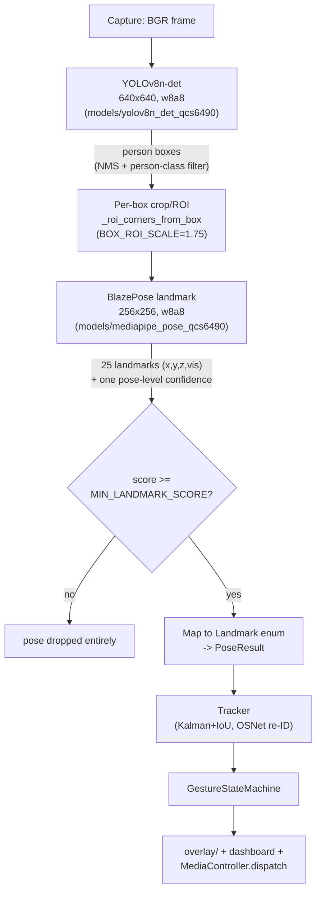
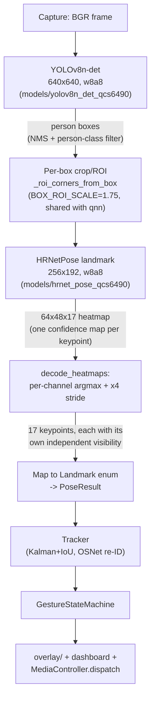
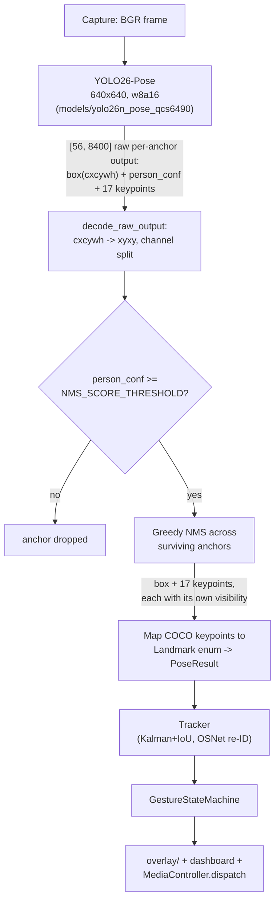

# Pipeline reference: design and performance, all three backends

This is the live current-state reference for `inference.backend`'s three
options -- what each pipeline actually does, stage by stage, and every
real performance number measured for it so far, on every board tested.
`docs/backlog.md` has the investigative narrative behind each of these
(what was tried, what failed, why a given design decision was made);
this document is just "what's true right now," kept in one place instead
of scattered across several backlog entries that would otherwise drift
out of sync with each other. `docs/journey.md` has the story-length
version for context on how the project got here at all.

## `qnn` -- YOLOv8n-det + BlazePose-landmark (current default)

Two BlazePose-specific weak points motivated evaluating the alternatives
below: the crop/ROI step is a whole extra layer that's already needed
real tuning (`BOX_ROI_SCALE`, frame-edge clamping -- see
`scripts/qnn_spike.md`), and the single pose-level `MIN_LANDMARK_SCORE`
gate at **E** rejects the *entire* pose if it dips, even when most
individual keypoints are perfectly visible.

## `hrnet` -- YOLOv8n-det + HRNetPose-landmark (alongside evaluation)

Same first stage and crop geometry as `qnn` -- only the landmark model
changes. No single whole-pose confidence gate: each keypoint's own
heatmap peak is its confidence, so a low-confidence wrist doesn't take
down an otherwise-good shoulder. Uses the same proven `w8a8` quantization
path as every other model here, unlike `yolo26` below.

## `yolo26` -- YOLO26-Pose, single end-to-end model (alongside evaluation)

No crop step at all -- detection and keypoints come out of one forward
pass over the whole frame, and (like `hrnet`) no single whole-pose
confidence gate. The tradeoff for removing the crop step: a full
640x640 forward pass every frame instead of a small per-person crop, which
shows up directly in the performance numbers below. Model compiled via
Ultralytics' own local QNN export, not Qualcomm AI Hub (whose compiler
fails on this model) -- see `docs/backlog.md` for that whole story,
including why the export must target QCS6490's real `soc_model` (`93`)
rather than a generic Hexagon-architecture-version target.

## Performance: every stage, every board tested

All NPU numbers below are median warm inference time over 20 calls, via
the exact `onnxruntime-qnn` runtime pattern used in production
(`inference/backends/_qnn_runtime.py`'s `create_qnn_session`), measured
directly over SSH on each physical board -- not simulator/estimate
numbers, except where noted.

| Stage | Model | Q6A (QCS6490) | Q8B (SC8280XP) |
|---|---|---|---|
| Person detector (`qnn` + `hrnet`'s shared 1st stage) | `yolov8n_det_qcs6490` | ~2.2ms | ~5.9ms |
| Landmark (`qnn` 2nd stage) | `mediapipe_pose_qcs6490` (landmark) | ~1.1ms | ~1.0ms |
| Landmark (`hrnet` 2nd stage) | `hrnet_pose_qcs6490` | ~5.7ms | ~6.5ms |
| End-to-end detect+pose (`yolo26`) | `yolo26n_pose_qcs6490` | ~14.9ms | ~9.9ms |
| General 80-class detect (dashboard viz only, not the pose pipeline) | `yolo26_det_qcs6490` | ~14.7ms | ~9.6ms |

Note the Q6A/Q8B relationship flips between rows: the Q8B is slower for
the two-stage pipeline's models but faster for the YOLO26 models,
despite sharing the same Hexagon V68 architecture. Not root-caused --
plausible clock/binning/driver-stack differences between the two
physical boards -- but consistent enough across repeated runs that it's
a real effect, not measurement noise.

## Full-pipeline real-footage results

Measured running the *entire* pipeline (capture -> pose -> track ->
gesture, identical `Tracker`/`ReidEmbedder` config) against the same
recorded footage on the Q6A -- see `docs/backlog.md` for the full
writeup and caveats (single person in frame, small YOLO26 calibration
set).

| Pipeline | Frames with a pose detected | Track IDs for the one real person | Gestures triggered | Speed |
|---|---|---|---|---|
| `qnn` (default) | 451/923 (49%) | 2 (fragmented) | 7 | ~22.1 fps |
| `yolo26` | 890/923 (96%) | 1 (continuous) | 14 | ~12.6 fps |
| `hrnet` | not yet tested | not yet tested | not yet tested | not yet tested |

The `yolo26` fps gap versus `qnn` isn't yet root-caused -- see
`docs/backlog.md`'s Performance section for the current hypotheses
(compute cost of a full 640x640 forward pass vs. a small crop, `w8a16`
vs. `w8a8` overhead, Python-side decode cost) and what would need
measuring to tell them apart.

## Live system resource usage (`yolo26`, real webcam + dashboard, both boards)

The results earlier in this doc were a scripted, offline comparison
against a fixed recording. These are the first measurements of the
*whole running app* under real, live use -- webcam capture, re-ID, the
web dashboard, and media control all running together, sampled every 5s
throughout each interactive test session (`docs/backlog.md` has the full
writeup of both):

| Metric | Q6A (~45 min session) | Q8B (~30 min session) |
|---|---|---|
| FPS | ~9.6 avg (range 6.6-10.3) | ~9.9 avg (range 7.9-9.9) |
| CPU | ~552% avg, 640% max (of 800% total, 8 cores) | ~245% avg, 259% max (of 800% total, 8 cores) |
| RSS memory | ~251MB avg, 253MB max (stable) | ~279MB avg, 287MB max (stable) |
| System RAM available | 7.4GB total | -- |

Both live FPS numbers are lower than the ~12.6fps scripted comparison
above -- expected, since these runs additionally pay for real webcam
capture, re-ID appearance matching, dashboard JPEG encoding, and
media-status polling that the scripted test never included. The FPS gap
between boards is small (9.6 vs 9.9), but **the CPU gap is not** --
the Q8B sustained essentially the same throughput at less than half the
Q6A's CPU usage. Per-model NPU latency was already measured faster on
the Q8B for `yolo26` (~9.9ms vs ~14.9ms, earlier table) but that alone
doesn't explain matched FPS *and* lower CPU -- if the NPU call finishes
faster but the achieved frame rate barely moves, something else in the
loop (camera read cadence, Python-side decode, JPEG encoding) is likely
the actual bottleneck holding both boards near ~10fps, and the Q8B's
faster NPU is showing up as idle headroom instead of extra frames. Not
confirmed -- worth profiling the loop's own stages in isolation before
concluding. **NPU utilization itself is not visible through any tool
used so far** on either board -- only per-model inference *latency* (the
tables above), not a load percentage, so how much NPU headroom remains
at this frame rate is still unknown. `qnn` and `hrnet` have no
equivalent live measurement yet on either board.
